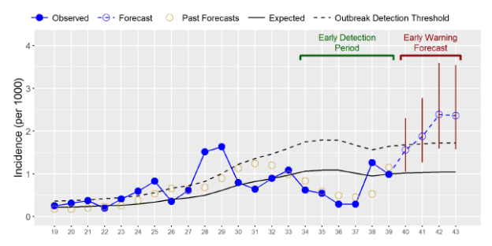

## Project Description

The Epidemic Prognosis Incorporating Disease and Environmental Monitoring for Integrated Assessment (EPIDEMIA) system has been developed to support malaria early warning in epidemic-prone regions of the Ethiopian highlands. EPIDEMIA is designed to enhance malaria surveillance by harnessing the potential of big data and predictive analytics to forecast the timing and locations of malaria outbreaks. To accomplish this goal, the system incorporates a set of linked software components that automate data access and harmonization, implement predictive modeling of malaria outbreaks, and generate charts and maps to communicate the predictions. 

A major feature of EPIDEMIA is the integration of temperature, precipitation, and vegetation data from earth-observing satellites to monitor the environmental risk factors for malaria outbreaks. These tools are being developed and tested by an interdisciplinary team that includes scientists from the University of Oklahoma and South Dakota State University along with partners from public health agencies, non-governmental organizations, and universities in Ethiopia. This research is funded by a grant from the National Institutes of Health, National Institute of Allergy and Infectious Diseases (R01AI079411). Development of software for acquisition and processing of earth observation data has also been supported by NASA (NNX11AF67G). More information is available at https://epidemia.sdstate.edu/.

## Partner Organizations

* South Dakota State University
* Amhara Regional Health Bureau
* Health, Development, and Anti-Malaria Association
* Bahir Dar University

## Publications

* Merkord, C. L., Y. Liu, A. Mihretie, T. Gebrehiwot, W. Awoke, E. Bayabil, G. M. Henebry, G. T. Kassa, M. Lake, and M. C. Wimberly. 2017. Integrating malaria surveillance with climate data for outbreak detection and forecasting: the EPIDEMIA system. Malaria Journal 16:89.
* Alemu, H. T., A. T. Kaptue, B. G. Senay, M. C. Wimberly, and G. M. Henebry. 2015. Evapotranspiration in the Nile Basin: Identifying dynamics and drivers, (2002-2011). Water 7: 4914-4931.
* Liu, Y., J. Hu, I. Snell-Feikema, M. S. VanBemmel, A. Lamsal, M. C. Wimberly. 2015. Software to facilitate remote sensing data access for disease early warning systems. Environmental Modelling and Software 74: 238-246. 
* Midekisa A., B. Beyene, A. Mihretie, E. Bayabil, M. C. Wimberly. 2015. Seasonal associations of climatic drivers and malaria in the highlands of Ethiopia. Parasites & Vectors 8: 339. 
* Midekisa, A., G. B. Senay, and M. C. Wimberly. 2014. Multi-sensor Earth Observations to Characterize Wetlands and Malaria Epidemiology in Ethiopia. Water Resources Research 50: 8791-8806.
* Wimberly, M. C., and A. Midekisa. 2014. Hydro-epidemiology of the Nile Basin: Understanding the complex linkages between water and infectious diseases. Pages 219-236 In: A. M. Melesse, W. Abtew, and S. G. Setegn, editors. Nile River Basin: Ecohydrological Challenges, Climate Change and Hydropolitics. Springer, New York.
* Midekisa, A., G. Senay, G. M. Henebry, P. Semuniguse, and M. C. Wimberly. 2012. Remote sensing-based time series models for malaria early warning in the highlands of Ethiopia. Malaria Journal 11: 165.
* Wimberly, M. C., A. Midekisa, P. Semuniguse, H. Teka, G. M. Henebry, T. Chuang, and G. B. Senay. 2012. Spatial synchrony of malaria outbreaks in a highland region of Ethiopia. Tropical Medicine & International Health 17: 1192-1201.
